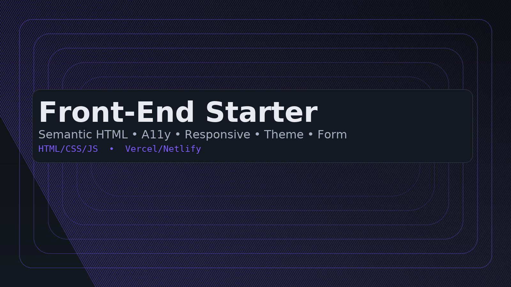

# Front-End Starter (HTML/CSS/JS)
> Semantic HTML, a11y, responsive layout (375/768/1280), theme toggle (localStorage), and a production-ready form flow.

[🇹🇷 Türkçe](#türkçe) • [🇬🇧 English](#english)

---

## Türkçe

### Öz
Semantik HTML5, erişilebilirlik (a11y), responsive Grid/Flex, tema değiştirici ve EmailJS/fetch ile form gönderimi içeren minimal başlangıç şablonu. Vercel/Netlify ile sıfır build adımıyla yayınlanır.

### Özellikler
- **Semantik HTML5** (`header/nav/main/section/footer`, skip-link, ARIA)
- **A11y odaklı stil** (kontrast, odak görünürlüğü, sr-only)
- **Responsive** (375 / 768 / 1280 breakpoint’leri, Grid + Flex)
- **Tema toggler** (dark/light, `localStorage` ile kalıcı)
- **Form akışı** (loading/hata/başarı; **EmailJS** veya **fetch**)
- **Temiz yapı** (`.editorconfig`, güncel `.gitignore`)
- **Statik dağıtım** (Vercel/Netlify tek tık)

### Hızlı Başlangıç
1. **Use this template** veya `git clone` ile projeyi al.  
2. `index.html`’i **Live Server** ile aç.  
3. İçeriği `index.html`, `css/styles.css`, `js/app.js` üzerinden düzenle.

> Not: Derleme süreci yok; saf HTML/CSS/JS.

### Proje Yapısı
```
.
├─ index.html
├─ css/
│  └─ styles.css
├─ js/
│  └─ app.js
├─ assets/
│  ├─ images/      # görseller
│  └─ fonts/       # .woff2 fontlar
├─ .editorconfig
├─ .gitignore
├─ LICENSE
└─ README.md
```

### Özelleştirme
**Renkler & Temalar** – `css/styles.css` içindeki CSS değişkenlerini güncelle:
```css
:root {
  --bg:#0d0f12; --bg-2:#141820; --txt:#e8eaf0; --muted:#a7b0c0;
  --accent:#7c5cff; /* marka rengi */
  --border:#2a2f3a; --radius:14px;
}
html[data-theme="light"] { /* açık tema varyantları */ }
```

**Yazı Tipi Ekleme**
```css
@font-face{
  font-family:'Inter';
  src:url('/assets/fonts/Inter-Variable.woff2') format('woff2');
  font-weight:100 900; font-display:swap;
}
body{ font-family: Inter, system-ui, Segoe UI, Roboto, Arial, sans-serif; }
```

### Form Entegrasyonu
**A) EmailJS (backend gerekmez)**
```html
<script src="https://cdn.jsdelivr.net/npm/emailjs-com@3/dist/email.min.js"></script>
```
```js
// js/app.js
// window.emailjs.init('PUBLIC_KEY');
// await window.emailjs.send('SERVICE_ID','TEMPLATE_ID',{ email });
```

**B) Kendi API’n (fetch)**
```js
await fetch('https://api.senin-domainin.com/subscribe', {
  method:'POST', headers:{'Content-Type':'application/json'},
  body: JSON.stringify({ email })
});
```

### Kalite Hedefleri
- **Lighthouse ≥ 90** (Performance, Accessibility, Best Practices, SEO)
- Tüm görsellere **alt**, formlara **label**, **odak görünür**, **kontrast ≥ 4.5:1**
- 375/768/1280 genişliklerinde yatay kaydırma olmadan düzgün akış

### Dağıtım (Deploy)
**Vercel**
- New Project → Import GitHub → Framework: *Other* → Output: repo kökü → Deploy

**Netlify**
- Add new site → Import from Git → Build command: *(boş)* → Publish dir: `/`

### Katkı & Lisans
PR’lere açığım; küçük iyileştirmeler ve örnek sayfalar memnuniyetle.  
Bu proje **MIT License** ile lisanslıdır.

---

## English

### Overview
A minimal starter with semantic HTML5, accessibility (a11y), responsive Grid/Flex, a theme toggle, and a production-ready form flow via EmailJS or fetch. Ships to Vercel/Netlify with zero build steps.

### Features
- **Semantic HTML5** (`header/nav/main/section/footer`, skip-link, ARIA)
- **A11y-minded styles** (contrast, visible focus, sr-only)
- **Responsive** (375 / 768 / 1280 breakpoints, Grid + Flex)
- **Theme toggle** (dark/light, persisted via `localStorage`)
- **Form flow** (loading/error/success; **EmailJS** or **fetch**)
- **Clean layout** (`.editorconfig`, modern `.gitignore`)
- **Static hosting** (one-click on Vercel/Netlify)

### Quick Start
1. Use as template or `git clone`.  
2. Open `index.html` with **Live Server**.  
3. Edit `index.html`, `css/styles.css`, `js/app.js`.

> No build pipeline; plain HTML/CSS/JS.

### Project Structure
```
.
├─ index.html
├─ css/
│  └─ styles.css
├─ js/
│  └─ app.js
├─ assets/
│  ├─ images/      # images
│  └─ fonts/       # .woff2 fonts
├─ .editorconfig
├─ .gitignore
├─ LICENSE
└─ README.md
```

### Customization
**Colors & Themes** – tweak CSS variables in `css/styles.css`.
```css
:root{
  --bg:#0d0f12; --bg-2:#141820; --txt:#e8eaf0; --muted:#a7b0c0;
  --accent:#7c5cff; --border:#2a2f3a; --radius:14px;
}
html[data-theme="light"] { /* light theme overrides */ }
```

**Add a Font**
```css
@font-face{
  font-family:'Inter';
  src:url('/assets/fonts/Inter-Variable.woff2') format('woff2');
  font-weight:100 900; font-display:swap;
}
body{ font-family: Inter, system-ui, Segoe UI, Roboto, Arial, sans-serif; }
```

### Form Integration
**A) EmailJS (no backend)**
```html
<script src="https://cdn.jsdelivr.net/npm/emailjs-com@3/dist/email.min.js"></script>
```
```js
// js/app.js
// window.emailjs.init('PUBLIC_KEY');
// await window.emailjs.send('SERVICE_ID','TEMPLATE_ID',{ email });
```

**B) Your API (fetch)**
```js
await fetch('https://api.your-domain.com/subscribe', {
  method:'POST', headers:{'Content-Type':'application/json'},
  body: JSON.stringify({ email })
});
```

### Quality Targets
- **Lighthouse ≥ 90** across Performance, Accessibility, Best Practices, SEO
- Every image has **alt**, forms have **labels**, **visible focus**, **contrast ≥ 4.5:1**
- Smooth, no-overflow layout at 375/768/1280 widths

### Deployment
**Vercel**
- New Project → Import GitHub → Framework: *Other* → Output: repo root → Deploy

**Netlify**
- Add new site → Import from Git → Build command: *(empty)* → Publish dir: `/`

### Contributing & License
Open to PRs—small improvements and example pages are welcome.  
Licensed under the **MIT License**.
